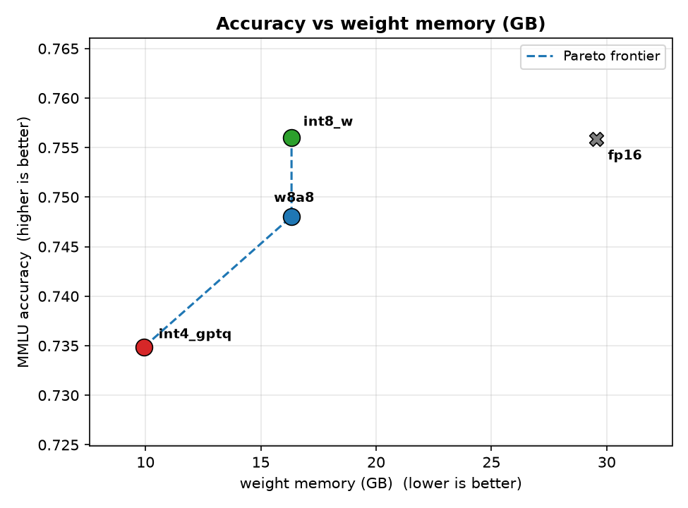
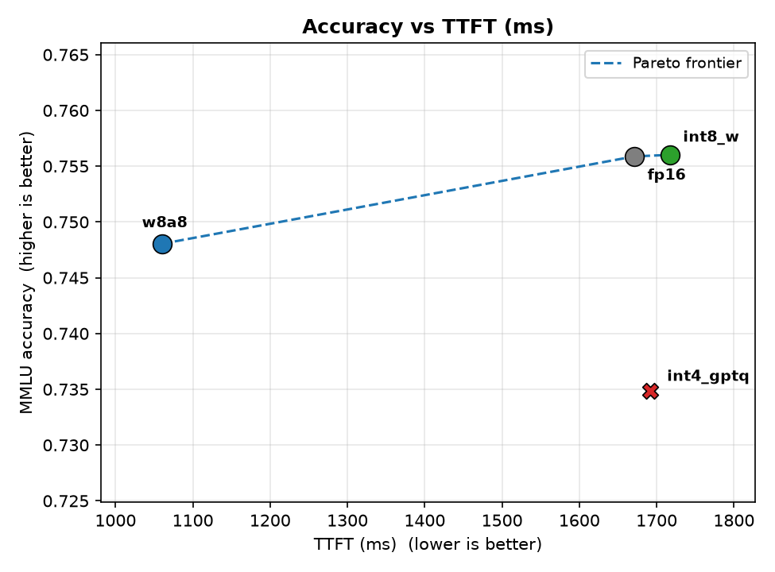

<div align="center">

# efficient-vlm-inference

**Post-training compression of a 14B instruction model, measured as an accuracy, latency, and memory Pareto frontier on the vLLM serving stack.**


</div>

This project takes a single open model, Qwen2.5-14B-Instruct, and runs it through four post-training quantization schemes, then measures what each one costs and saves. The output is a Pareto frontier over accuracy, throughput, and memory, plus a per-task degradation analysis. The whole pipeline is single-GPU post-training: no pretraining, no multi-GPU parallel training. That boundary is stated plainly, and the last section says exactly what a production or frontier setup would add on top.

Accuracy is measured on two deliberately different tasks. MMLU is 4-way multiple choice and stresses a single decision token. HumanEval is code generation and stresses multi-step output whose errors compound across tokens. Reporting both, rather than one aggregate score, is what makes the degradation analysis honest: it shows whether low-bit quantization hits one kind of task harder than the other.

## Results

All numbers are measured on Qwen2.5-14B-Instruct. Accuracy is full MMLU (14,042 questions) and HumanEval pass@1 (164 problems). Speed and memory come from vLLM on a single GPU; the four configs were benchmarked on one card so throughput is comparable.

| Config | MMLU | HumanEval pass@1 | tokens/s | TTFT (ms) | weight mem (GB) | bits/weight |
|---|---|---|---|---|---|---|
| FP16 baseline | 75.59% | 69.51% | 2908 | 1671 | 29.5 | 16 |
| INT8 weight-only | 75.60% | 70.12% | 2755 | 1717 | 16.3 | 8 |
| INT4 GPTQ | 73.49% | 68.29% | 2772 | 1692 | 9.9 | ~4 |
| W8A8 | 74.80% | 69.51% | 3763 | 1060 | 16.3 | 8 |




**INT8 is nearly free.** Weight-only INT8 matches FP16 on both tasks (MMLU +0.01, HumanEval +0.6, both within noise) while cutting weight memory by 45% (29.5 to 16.3 GB). It is the obvious default.

**INT4 buys a 3x memory cut for a small, honest accuracy cost.** INT4-GPTQ drops MMLU by 2.1 points and HumanEval by 1.2 points in exchange for shrinking the model from 29.5 GB to 9.9 GB.

**W8A8 is the throughput winner.** Quantizing activations as well as weights gives the highest throughput (3763 tok/s) and lowest first-token latency (1060 ms), with accuracy within about one point of FP16.

**The honest degradation finding.** A common assumption is that low-bit quantization damages multi-step generation (code) more than single-token tasks (multiple choice). The measurements do not support that here: INT4-GPTQ degrades MMLU (2.1 pt) slightly more than HumanEval (1.2 pt), and both drops are small and close to evaluation noise. At this model size and quantization strength the weight-only degradation is roughly uniform across task types rather than concentrated in code. The full per-task relative-drop table, including failing HumanEval task ids, is in `results/summary.json`.

Note on the Pareto frontiers: FP16 is off the memory frontier entirely, since INT8 matches its accuracy at 45% less memory and dominates it.

## Requirements

- A single CUDA GPU that fits Qwen2.5-14B in FP16 (about 30 GB of VRAM; an L40S, A6000, A100, or H200 all work).
- CUDA 12.1, Python 3.11.
- The pinned stack in `requirements.txt`. Versions are pinned deliberately: transformers is held at 4.46.3 because newer versions break llm-compressor's GPTQ calibration on Qwen2, and vLLM 0.6.6.post1 pairs with compressed-tensors 0.8.1 and llmcompressor 0.3.1.

## Getting Started

The pipeline runs as five plain Python scripts. Each stage is idempotent: every finished work unit writes a `_DONE.json` marker, so re-running a stage skips completed work and only computes what is missing.

### 1. Install

```bash
python -m venv .venv && source .venv/bin/activate
pip install torch==2.5.1 --index-url https://download.pytorch.org/whl/cu121
pip install -r requirements.txt
```

### 2. Download the model and datasets (needs internet)

```bash
python scripts/run_download.py
```

Caches Qwen2.5-14B-Instruct, MMLU, HumanEval, and the wikitext calibration set into `hf_cache/` and `data/`. After this, the compute stages read only from the local cache.

### 3. Quantize

Produces the INT8, INT4-GPTQ, and W8A8 checkpoints (FP16 needs none). A single 14B GPTQ config takes roughly 30-90 minutes on one GPU.

```bash
python scripts/run_quantize.py
# progress (target: 3 markers for int8_w, int4_gptq, w8a8)
find quantized -name _DONE.json | wc -l
```

### 4. Benchmark throughput, latency, and memory

Run all configs on the same GPU so the speed numbers are comparable.

```bash
python scripts/run_benchmark.py
find results/benchmark -name _DONE.json | wc -l   # target: 4
```

### 5. Evaluate MMLU and HumanEval

`run_evaluate.py` completes one pending (config, task) unit per invocation and is sharded internally (MMLU by subject, HumanEval by problem), so it resumes cleanly if interrupted. There are eight units (4 configs x 2 tasks); loop until all are done:

```bash
until [ "$(find results/mmlu results/humaneval -name _DONE.json | wc -l)" -eq 8 ]; do
  python scripts/run_evaluate.py
done
```

Accuracy does not depend on GPU type, so this stage can use any card that fits the model.

### 6. Build the Pareto frontier and figures

```bash
python scripts/run_analyze.py
```

Writes `results/summary.json` (both Pareto frontiers plus the degradation table) and `docs/pareto_memory.png` / `docs/pareto_latency.png`.

## Running on a Slurm cluster (optional)

The `slurm/` directory has thin submission wrappers around the same scripts. Set `PROJECT_BASE` to the project directory (the wrappers default it to `$SLURM_SUBMIT_DIR`) and call the environment's Python by absolute path rather than relying on `conda activate`, which is unreliable on compute nodes. Build the environment and download data on a node with internet, then set `HF_HUB_OFFLINE=1` for the compute stages. Quantization needs a wall clock long enough for a full config (there is no mid-config checkpoint); evaluation shards finely and resumes well, so a job array drives it to completion:

```bash
sbatch slurm/run_stage_h200.sbatch scripts/run_quantize.py
sbatch slurm/run_stage_gpushort.sbatch scripts/run_benchmark.py
sbatch --array=1-8%1 slurm/run_stage.sbatch scripts/run_evaluate.py
```

## How production would differ

- **Scale.** This is a single 14B model on one GPU. A frontier setup is 70B and up with multi-GPU tensor and pipeline parallelism. That axis is out of scope here and is the direction I most want to work on next.
- **Quantization frontier.** Production also reaches for FP8 on Hopper and Blackwell, activation-aware joint weight-activation schemes, and dynamic range management. This project covers mainstream INT8 and INT4 plus the SmoothQuant path for W8A8.
- **Serving.** Real serving adds paged-KV, continuous batching at load, and speculative decoding. This project uses vLLM's existing batching and metrics rather than building a serving layer.

## Design Notes

- **Weight-only vs weight+activation.** INT4 is weight-only because activations carry outlier channels whose dynamic range is hard to fit in 4 bits. W8A8 quantizes activations too (with SmoothQuant migrating the outliers into the weights first), trading a little accuracy for a faster INT8 kernel, which is why it wins on throughput and TTFT.
- **Why GPTQ and not AWQ.** The plan included an INT4-AWQ config, but autoawq is officially deprecated and its current release imports transformers internals not present in the 4.46.3 pin that GPTQ calibration requires. The AWQ path is left in `src/quantize.py` but disabled in the config; INT4 is produced with GPTQ. This is a dependency-compatibility call, not an algorithmic one.
- **Calibration.** GPTQ and SmoothQuant calibrate on wikitext-2, which does not overlap the MMLU test split or HumanEval, so the accuracy numbers are not contaminated by the calibration data.
- **Measuring on vLLM.** Throughput is batched decode tokens over wall time; TTFT is prefill latency to the first token, read from vLLM per-request metrics, and is a separate number from steady-state throughput.
- **Memory axis.** The Pareto memory axis is the on-disk weight footprint, which is exact and comparable across bit-widths. End-to-end serving also holds a KV cache, which is quantizable separately.

## Future Work

- INT4-AWQ once a maintained toolchain (for example the AWQ support in llm-compressor) is compatible with the pinned stack, to compare against INT4-GPTQ directly.
- KV-cache quantization and its effect on long-context memory.
- Per-layer sensitivity analysis feeding a mixed-precision assignment that keeps the most sensitive layers at higher precision.
- Extending the same pipeline to a small VLM with an OCR-heavy task, where quantization sensitivity is easier to surface.

## License

MIT. See `LICENSE`.
